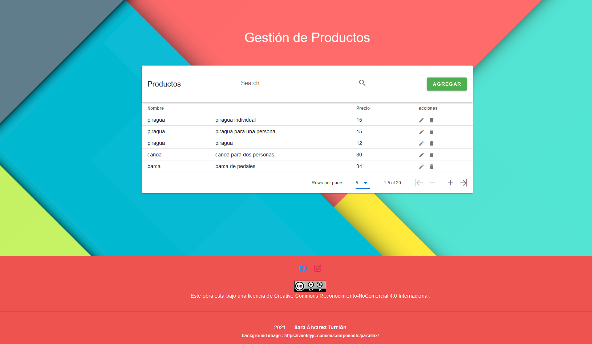
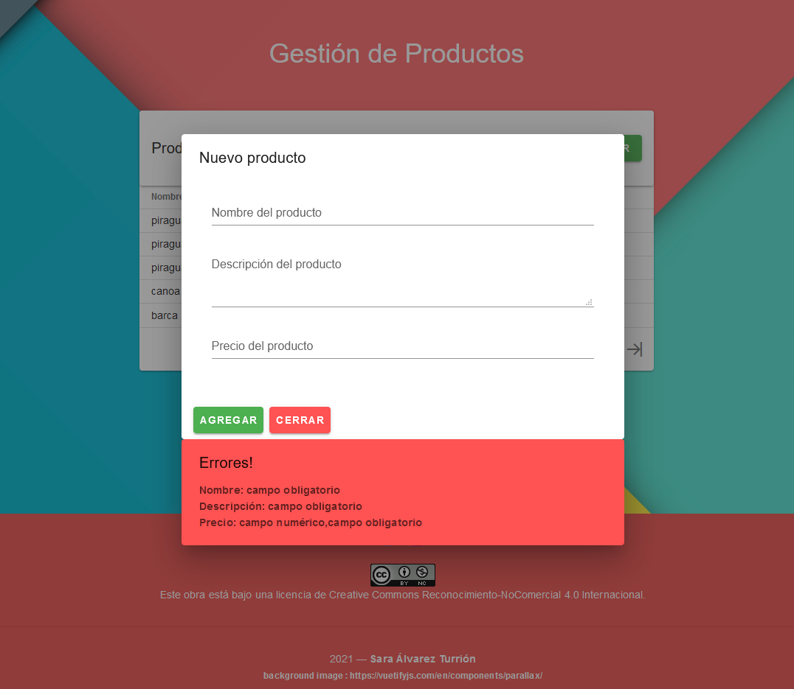
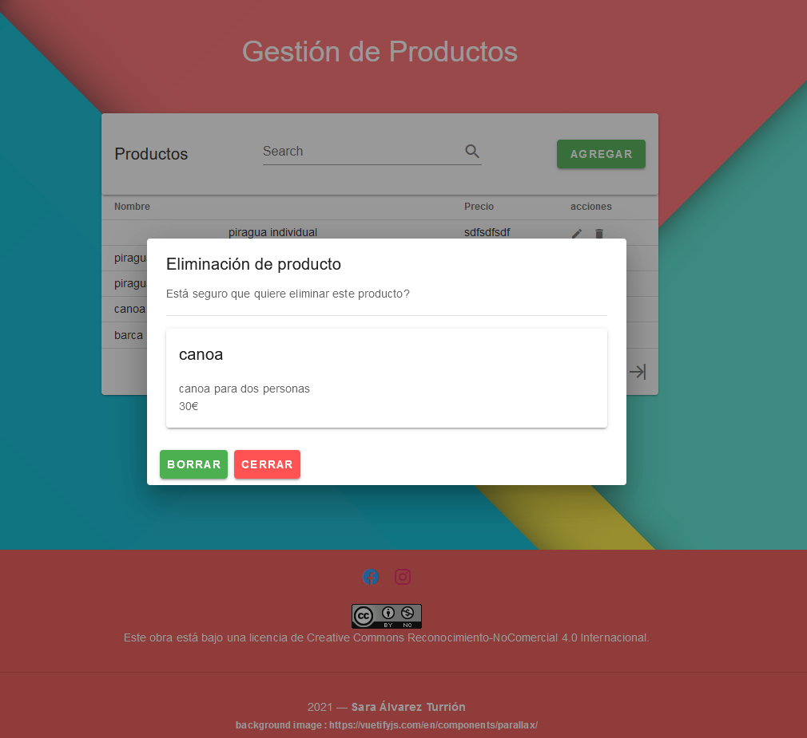

Pequeño Modelo Vista Controlador para la gestión de productos.  
Desarrollado con las tecnologías Laravel, Vue y Vuetify como material design.  
Gestión de productos con registro, edición, eliminación y listado. 
Validación y control de errores.  

 Componentes Vue:  resource/js/components  
    Se encuentran los componentes utilizados para generar las vistas.   Desde el componente Inicio.vue se importan el resto de componentes necesarios para la gestión de los productos. 

 Back: Modelo y Controlador del producto  
    En ProductoController se encuentran los métodos necesarios para la gestión del producto, registralo, editarlo, eliminarlo y listar.  
    En cada método se realiza una validación con control de errores que se mostrará en la vista correspondiente

## Inicio: 

[Ver Código](https://github.com/SaraSat/MVC-Laravel-Vue/blob/master/resources/js/components/Inicio.vue "Código)

 

## Registro: 

[Ver Código](https://github.com/SaraSat/MVC-Laravel-Vue/blob/master/resources/js/components/Registro.vue "Código)
 

## Edicion: 

[Ver Código](https://github.com/SaraSat/MVC-Laravel-Vue/blob/master/resources/js/components/Edicion.vue "Código)
 

## Eliminacion: 

[Ver Código](https://github.com/SaraSat/MVC-Laravel-Vue/blob/master/resources/js/components/Borrar.vue "Código)

## Laravel: [Ver Código Php](https://github.com/SaraSat/MVC-Laravel-Vue/blob/master/app/Http/Controllers/ProductoController.php "Código Php)